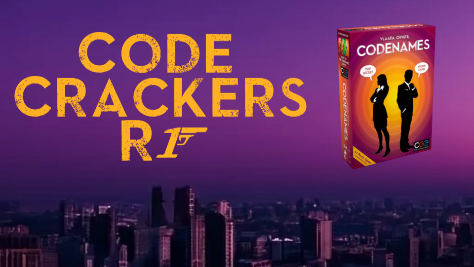

# Codenames

  

We will create a simple, accessible web application version of Codenames for 4+ players that delivers all the fun, fast-paced party aspects that made Codenames successful while allowing users the freedom to play how they want.

## Technologies Used

- Node - We decided on Node to run our application. While we wanted to explore Deno it's hard not to stick with what works

  - Next.js – Used for our full stack approach. Powered by React. Due to this we don't have a seperate frontend and backend folder. The closest to a backend folder is the app/api folder.
    - React - Our frontend javascript framework that we ended up going with

- Supabase - We ended up going with Supabase for our database as it has great integration with Next.js and allows us to have an easy auth flow

## Demo Video - WIP

## Account / Lobby

For R1 we wanted to have a working account and lobby.

## Game

For R2 we finished up implementing the game and now (hopefully) have a fully featured game available at https://codenames.traudt.dev

## Our Team

1. Aden Williams || [awilliams107](https://github.com/awilliams107)
2. [Blaine Traudt](https://traudt.dev) || [blaine-t](https://github.com/blaine-t)
3. Grant Seagren || [gcseagren](https://github.com/gcseagren)
4. Lance Buscher || [lanchebshr](https://github.com/lancebshr)
